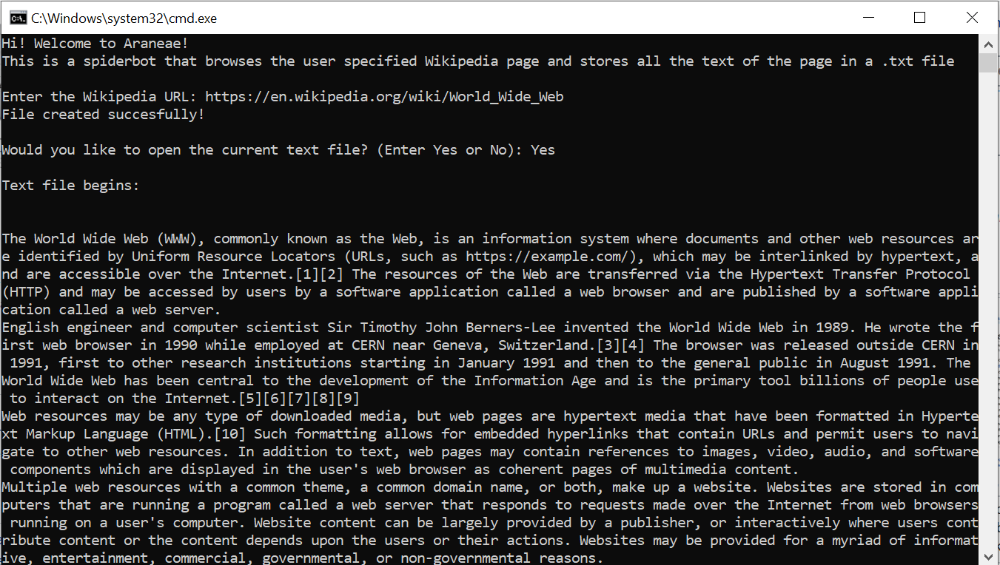

# Araneae


This is a python3 program that works as a Wikipedia crawler and utilizes BeautifulSoup and the requests modules. It goes through the entire Wikipedia page of the user entered URL and stores the information available on the wikipedia page as a .txt file on the system locally. 





## Setup


### Installation

1. Install ```Python 3.7``` or above.
2. Install these modules:
    - requests
    - bs4
    
    
### Running the program

1. Download the ```Crawler.py``` file.
2. Open the folder containing the aforementioned file in your terminal (for MacOS and Linux) or command prompt (for Windows).
3. Type ```python Crawler.py``` and press enter to run the program.

**OR**

1. Install any IDE.
2. Create a new project, copy the ```Crawler.py``` code and paste it in a ```.py``` file.
3. Run the program.

## Contributing

Pull requests are welcome for adding more feautures or fixing exisiting issues. 

## License

[MIT](https://github.com/janus-tg/Aranae/blob/master/LICENSE)
